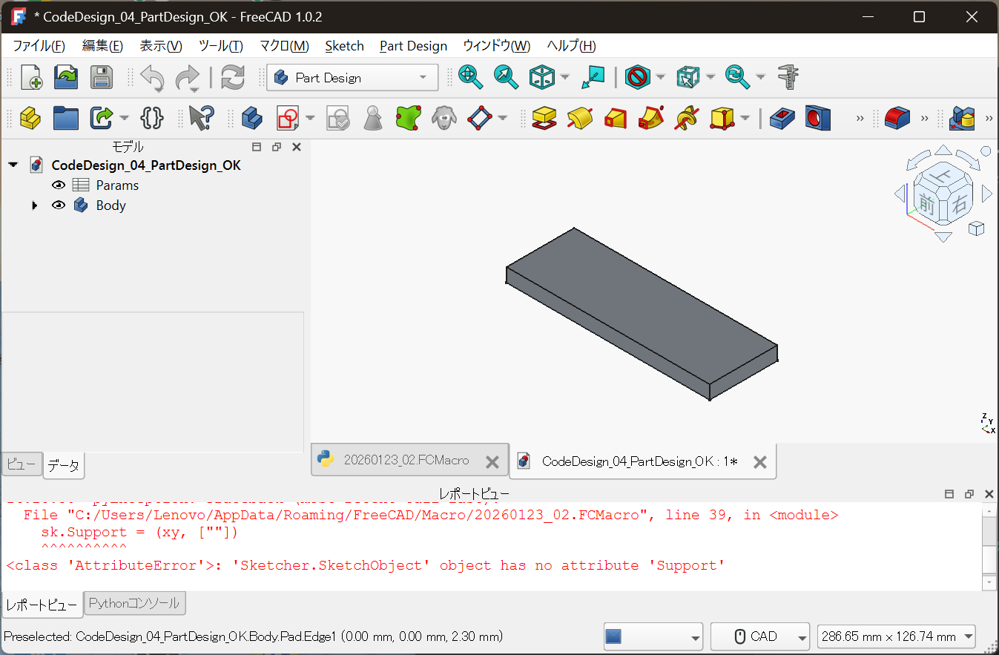
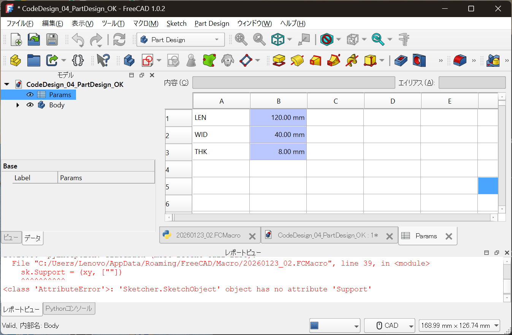

## はじめに

前回の記事では、  
FreeCAD を使って **コードだけで形状を生成する例** を示しました。

ただ、多くの現場設計者はこう思うはずです。

> 「でも実務は Part Design だよね？」

この記事では、その疑問に正面から答えます。

**Part Design を捨てずに、  
設計条件だけをコード側に逃がす。**

それが、現場で壊れない  
**コード設計の現実解**です。

---

## 今回やること

- 設計条件（寸法）を **コードで定義**
- FreeCAD の **Spreadsheet** に反映
- Part Design（Sketch / Pad）は **いつも通り GUI**
- 寸法変更は Spreadsheet だけで完結

---

## 完成状態（先に全体像）

まずは完成状態です。



- `Params`：設計条件（上流）
- `Body`：Part Design の形状（下流）

この分離が、今回のポイントです。

---

## 設計条件は Spreadsheet に集約する

設計の本体は、  
Sketch でも Pad でもありません。

それが分かるのが、この画面です。



```text
LEN = 120.00 mm
WID = 40.00 mm
THK = 8.00 mm
```

- 意味のある名前
- 単位付き
- ここだけを変更すれば設計が変わる

---

## コードでやっていること（最小限）

この構成で、コードが担っている役割はシンプルです。

- Spreadsheet を作る
- 設計パラメータを入れる
- Part Design の寸法拘束・Pad厚みに **式でリンク**

形状そのものは、  
**一切コードで描いていません。**

---

## なぜこの構成が現実的か

### Part Design を否定していない

- Sketch 拘束
- フィーチャ履歴
- 図面・後工程との親和性

これらは、  
現場で使われ続けている理由があります。

---

### でも、設計条件は GUI に埋めたくない

- なぜこの寸法なのか
- どこを変えると何が変わるのか
- 設計判断の根拠

これらを Sketch の中に閉じ込めると、  
**後から追えなくなります。**

---

## 役割分担をはっきりさせる

この構成の本質は、分業です。

| 役割 | 担当 |
|---|---|
| 設計条件・判断 | コード / Spreadsheet |
| 形状生成 | Part Design（GUI） |
| 視覚確認 | CADビュー |

**全部をコードにしない。**  
**全部を GUI に任せない。**

---

## 実際の使い方

1. `Params`（Spreadsheet）を開く  
2. 数値を変更する  
3. 再計算（Ctrl + R）  
4. 形状が追従する  

Sketch や Pad を触る必要はありません。

---

## 03_ との違い

- 03_：  
  コードだけで形状を生成（思想の実証）
- 04_：  
  **コードと GUI を分業**（実務への接続）

04_ は、  
**現場に置ける形**にした回です。

---

## おわりに

コード設計は、  
GUI CAD を置き換えるためのものではありません。

設計条件と設計判断を  
**再利用可能な形で残すための方法**です。

Part Design を使い続けながら、  
上流だけをコード化する。

これが、  
無理なく始められる  
**Full Code Mechanical Design の現実解**です。

---

次回は、  
この設計を **Git でどう管理するか**、  
差分・再設計・引き継ぎの話に進みます。
