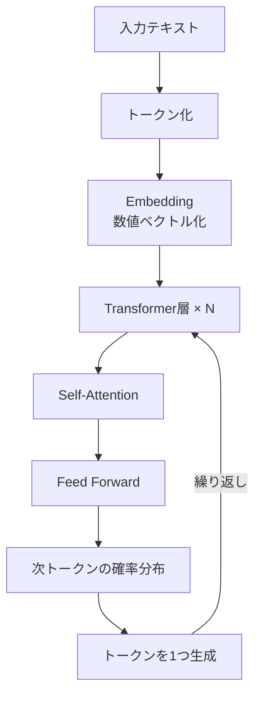
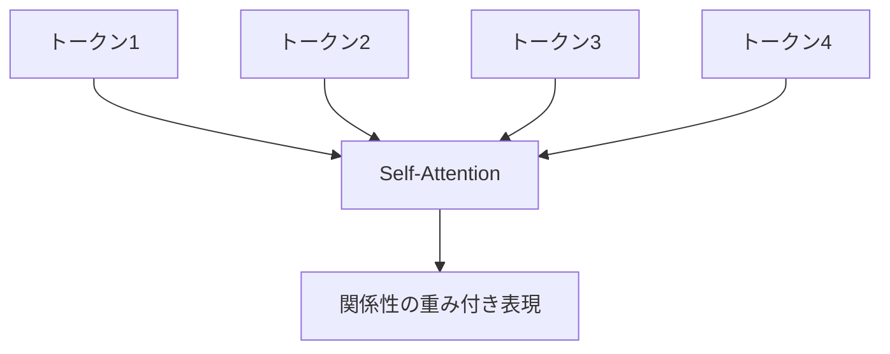
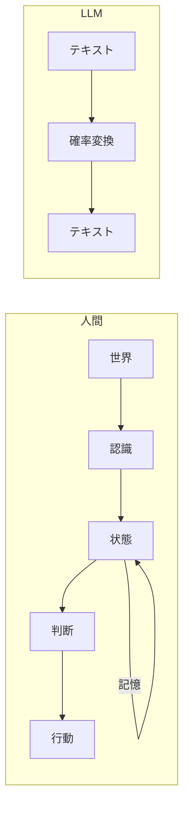

title: "24. LLMのからくりを構造で見る ― なぜ分かった気になるのか"
tags: [LLM, AI, 設計, Mermaid]

---

## 🧭 はじめに

LLM（Large Language Model）は賢く見える。  
説明もできるし、推論もしているように振る舞う。

ただ、少し中身を見ると分かるが、  
**やっていること自体は驚くほど単純**だ。

この記事では、

- 🔍 LLMが「何をしている装置なのか」
- 🧠 なぜ「理解しているように見えるのか」
- ⚠️ なぜ「制御や判断に直接使えないのか」

を、**構造（Mermaid）で可視化**する。

---

## 🎯 LLMがやっていること（結論）

LLMは常にこれだけをやっている。

> **次に来そうなトークンを確率で選ぶ**

意味を理解しているわけでも、  
世界を認識しているわけでもない。

**文脈 → 確率 → 生成**  
それだけの巨大な変換器である。

---

## 🏗 全体構造（LLMの中身）



ポイントは3つだけ。

- 📐 テキストは数値に変換される  
- 🎲 内部では確率計算しかしていない  
- 🔁 1トークンずつ生成を繰り返している  

「考えている」工程は存在しない。

---

## 🔎 Self-Attention の正体  
### なぜ理解しているように見えるのか



Self-Attentionは、

- 🧩 文中の**すべてのトークン同士の関係**を
- ⚡ **一度に計算**する仕組み

これにより、

- 主語と述語  
- 因果関係  
- 文脈依存  

を距離に関係なく拾える。

結果として  
**文脈を理解しているような文章**が生成される。

---

## 🧪 「理解していない」ことの可視化

LLMの内部では、次のようなことが起きている。

```
入力：
「LLMのからくりは」

内部：
--------------------------------
「単純」   : 0.41
「確率」   : 0.27
「実は」   : 0.12
「複雑」   : 0.08
その他      : ...
--------------------------------

→ 一番高いものを選ぶ
```

- ❌ 正解かどうかは見ていない  
- ❌ 意味が正しいかも判断していない  
- ⭕ **確率が高いかどうかだけ**  

それでも自然な文章になるのは、  
学習データが「人間の思考の痕跡」だからだ。

---

## 🧍 人間とLLMの決定的な違い



LLMには、

- 🧠 状態 ❌  
- 💾 記憶 ❌  
- 🎯 目的 ❌  
- 🌍 世界 ❌  

が存在しない。

あるのは  
**入力を出力に変換する関数**だけである。

---

## 🚫 なぜ制御や判断に使ってはいけないのか

理由は単純だ。

- 状態を保持できない  
- 正しさを評価できない  
- 時間的連続性を持てない  

つまり、

> **制御に必要な要素を、構造的に持っていない**

---

## 🛠 LLMが一番向いている役割

- 📝 曖昧な文章 → 構造化  
- 📄 ログ → 原因候補の列挙  
- 🧩 仕様 → 下書き生成  
- 🔍 差分 → 説明文生成  

**判断の前段階**  
**人間が面倒な中間作業**

ここに置くと、非常に強力だ。

---

## ✅ まとめ

```text
LLM = 知能 ❌
LLM = 思考 ❌
LLM = 判断 ❌

LLM = 文脈 → 確率 → 生成 の変換器 ⭕
```

ブラックボックスに見えるが、  
構造で見ると置き場所ははっきりする。

> LLMは「何ができるか」より  
> **「どこに置いてはいけないか」**を理解すると使える。
