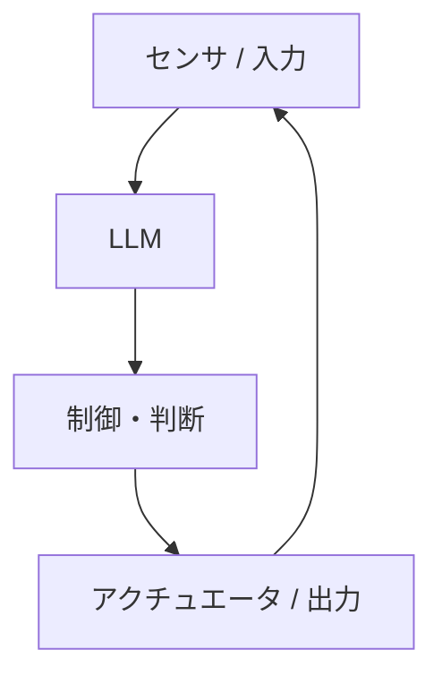
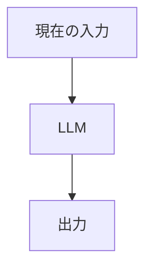
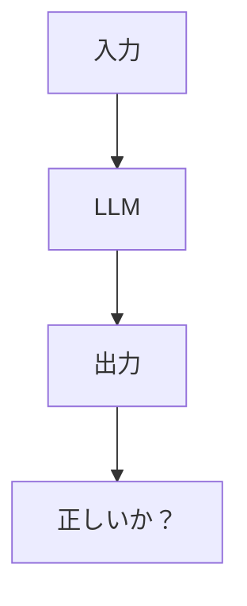
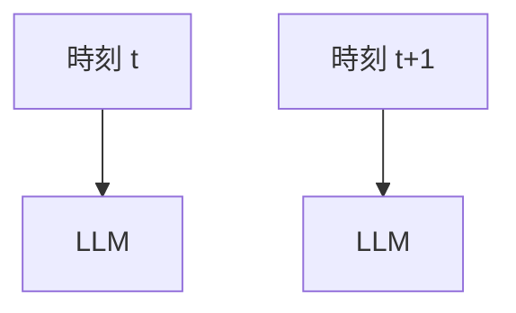
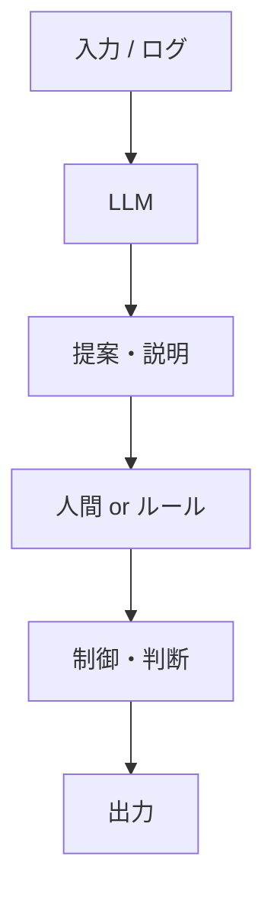

## 🧭 はじめに

前回の記事では、  
LLMの正体が **「文脈 → 確率 → 生成」の変換器**であることを整理した。

では次の疑問はこれだ。

> **そのLLMを、制御や判断のループに入れると何が起きるのか？**

結論から言うと、  
**かなりの確率で壊れる**。

この記事では、

- なぜ壊れるのか
- どこで破綻するのか
- なぜ「それっぽく動いてしまう」のか

を、**構造（Mermaid）で可視化**する。

---

## 🎯 よくある誤った構成

まずは、ありがちな構成から。



一見すると、

- 入力を理解して
- 判断して
- 行動している

ように見える。

だが、この構成は**構造的に破綻している**。

---

## ❌ どこがダメなのか（即死ポイント）

### ① 状態を保持できない



LLMは毎回、

- 過去の内部状態を持たない
- 前回の判断結果を覚えていない

**「今の入力」だけで出力を決める。**

制御に必要な  
**状態・履歴・連続性**が存在しない。

---

### ② 正しさを評価できない



この「？」を  
LLM自身は埋められない。

- 正解条件を持たない  
- 目的関数を持たない  
- 失敗を検知できない  

つまり、

> **間違っても、それに気づけない**

---

### ③ 時間を扱えない



LLMにとって、

- 時刻 t
- 時刻 t+1

は**無関係な別入力**。

遅れ・積分・安定性といった  
**時間依存の概念を内部に持てない**。

---

## 🧨 実際に起きる「それっぽい事故」

この構成が厄介なのは、  
**最初は動いて見える**ことだ。

- ログを見ると説明がうまい  
- たまに正しい判断をする  
- デモでは成功する  

しかし、

- 外乱が入る
- 想定外入力が来る
- 長時間動かす

と、次のようになる。

```text
・判断がぶれる
・出力が不安定になる
・説明は立派だが結果が破綻する
```

**一番危険なのは「自信満々に間違う」点**。

---

## 🧱 壊れない配置（最低限の分離）

では、どう置けば壊れないのか。



ここでのポイントは：

- LLMは **提案まで**
- 判断・制御は **別の層**

LLMは  
**「決めない」「動かさない」**。

---

## 🛠 LLMが安全に効く場所

LLMが強いのは、ここだ。

- 📝 状況説明の生成  
- 📄 ログの要約  
- 🔍 原因候補の列挙  
- 🧩 ルールや設計の下書き  

つまり、

> **判断の前段階に限定する**

これを守るだけで、  
事故率は一気に下がる。

---

## ✅ まとめ

```text
LLMを
・制御に使う ❌
・判断に使う ❌
・決定権を与える ❌

LLMを
・説明に使う ⭕
・整理に使う ⭕
・下書きに使う ⭕
```

LLMは賢く見えるが、  
**賢く振る舞えるだけ**だ。

> LLMを危険にするのは性能ではない。  
> **配置を間違えること**だ。

---

## 📌 次回予告

次は、ここまでを踏まえて：

- **LLMを外側に置いたとき、なぜシステムは安定するのか**
- **「層」を分けると、なぜ壊れにくくなるのか**

を、また **Mermaid1枚**で説明する。

続けるなら、  
**003 は「壊れない構造」**だ。
