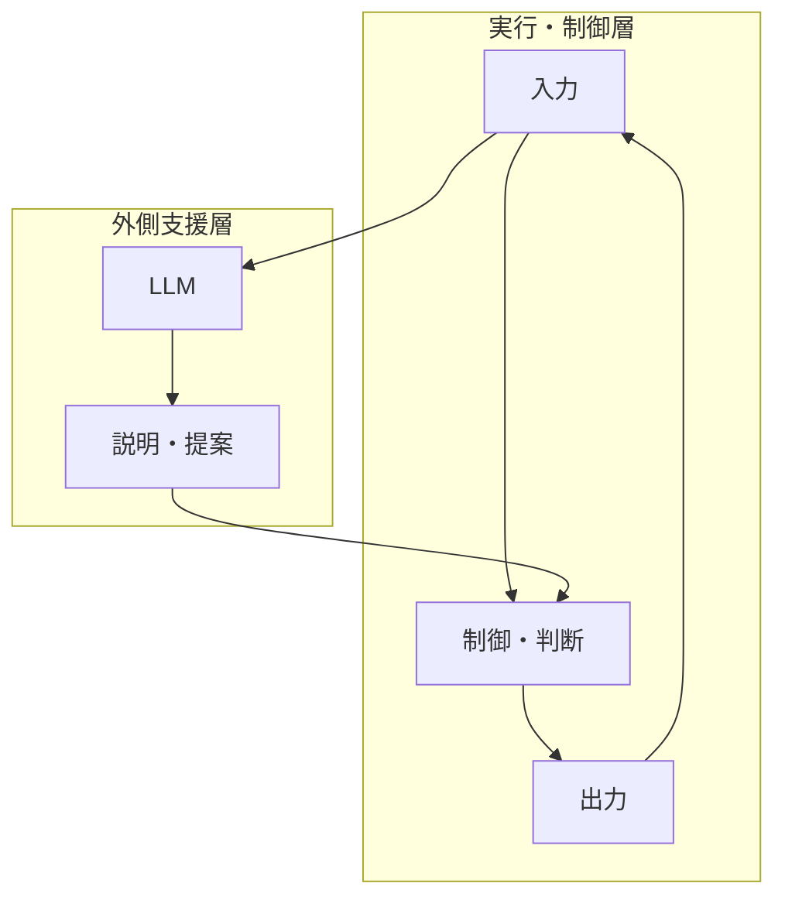
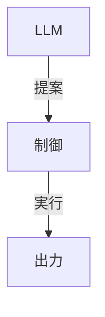
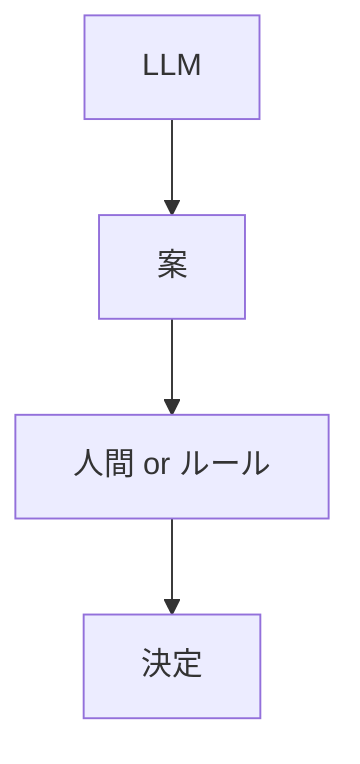
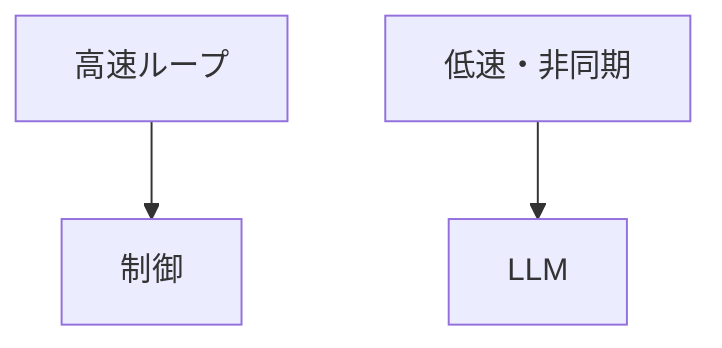
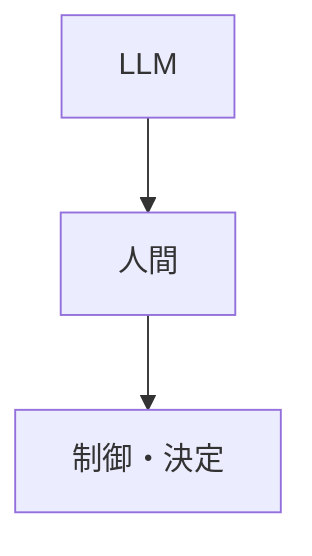

# 26. 【LLM設計】LLMを外側に置くとなぜ安定するのか ― 壊れない構造の作り方
tags: [LLM, AI, 設計, Mermaid]

---

## 🧭 はじめに

前回の記事では、  
LLMを制御や判断のループに入れると**なぜ壊れるか**を整理した。

では次の問いはこれだ。

> **LLMを「外側」に置くと、なぜシステムは安定するのか？**

答えは精神論ではない。  
**構造の問題**だ。

この記事では、

- 壊れない配置とは何か
- なぜ「層」を分けると安定するのか
- LLMをどこまで使ってよいのか

を、**構造（Mermaid）で可視化**する。

---

## 🎯 壊れない基本構造

まず、結論となる構造を先に出す。



この構造のポイントは明確だ。

- **制御ループは閉じている**
- LLMは**ループの外**にある
- LLMは結果を「変えない」

---

## 🧱 なぜ層を分けると安定するのか

### ① 役割が混ざらない



- LLM：言語・曖昧さ・整理
- 制御：状態・判断・実行

**やるべき仕事が重ならない。**

これだけで暴走要因が消える。

---

### ② 正しさの責任が明確



- LLMは責任を持たない
- 決定は必ず別の層が行う

つまり、

> **LLMは「責任のない知能」**

責任を持たせないから、安全になる。

---

### ③ 時間軸が分離される



- 制御：リアルタイム
- LLM：非同期・低速

時間スケールを分けることで、

- 遅延
- ばらつき
- 不確定性

が制御に侵入しない。

---

## 🛠 LLMが「最大効率」で効く位置

LLMを外側に置くと、  
次の仕事を安心して任せられる。

- 📝 ログの要約・説明
- 🔍 異常原因の候補列挙
- 🧩 ルール・設計の下書き
- 📄 人間向けの解説生成

共通点は一つ。

> **失敗しても、即システムは壊れない**

---

## 🚫 あえてやらせないこと

構造が分かると、  
「やらせないこと」もはっきりする。

```text
・最終判断
・実行トリガ
・安全判定
・リアルタイム制御
```

ここを渡した瞬間、  
再び壊れる。

---

## 🧠 人間の位置づけ



人間は、

- 全部を考えない
- でも最後は決める

**LLMは思考の外注先**  
**人間は責任の最終地点**

この役割分担が一番現実的だ。

---

## ✅ まとめ

```text
壊れる構造：
LLM → 判断 → 実行

壊れない構造：
制御 → 実行
   ↑
  LLM（提案のみ）
```

LLMは強力だが、  
**置き場所を間違えると毒になる**。

> LLMを賢く使うとは、  
> 能力を信じることではない。  
> **構造を疑うこと**だ。

---

## 📌 シリーズまとめ

- 24：LLMの正体（変換器）
- 25：壊れる構造（制御に入れるな）
- 26：壊れない構造（外側に置け）

ここまで理解できれば、  
LLMは「怖いもの」ではなく  
**設計可能な道具**になる。
