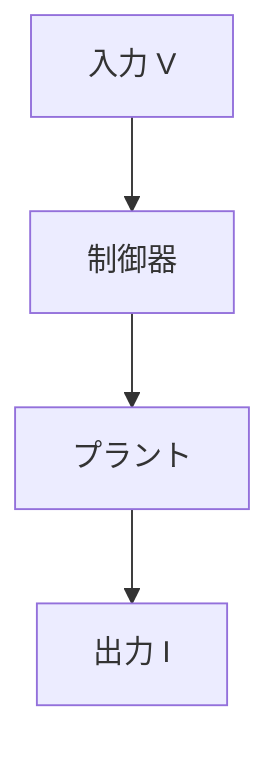

# GitHub Pages（Jekyll）で Mermaid 図を表示する方法

Qiita では ` ```mermaid ` を書くだけで図が表示されます。  
しかし GitHub Pages では **そのままではコードブロック表示**になります。

本記事では、**Qiita と同じ書き方で Mermaid 図を表示する方法**を解説します。

---

## 目的

- Markdown に ` ```mermaid ` を書く  
- GitHub Pages 上で図として描画する  

---

## Mermaid を読み込む

```html
<script defer src="https://cdn.jsdelivr.net/npm/mermaid@10/dist/mermaid.min.js"></script>
```

---

## code ブロックを Mermaid 用に変換

```html
<script>
  document.addEventListener("DOMContentLoaded", () => {
    if (!window.mermaid) return;

    document.querySelectorAll("code.language-mermaid").forEach(code => {
      const pre = code.parentElement;
      const div = document.createElement("div");
      div.className = "mermaid";
      div.textContent = code.textContent;
      pre.replaceWith(div);
    });

    mermaid.initialize({ startOnLoad: false });
    mermaid.run();
  });
</script>
```

---

## Markdown 記述例



---

## 実際の表示デモ

以下のページで、**Mermaid 図が描画されている状態**を確認できます。

- [907 デモページ（Mermaid 表示例）](https://samizo-aitl.github.io/qiita-articles/articles/907_demo_math_mermaid.html)

---

## 注意点

- Jekyll が Mermaid を描画するわけではありません  
- **DOM 変換 → Mermaid.js が描画**という流れです  

---

## まとめ

- GitHub Pages でも Mermaid 図は表示可能  
- Qiita と同じ ` ```mermaid ` 記法を維持できる  
- JavaScript 側の変換処理が必須です  
