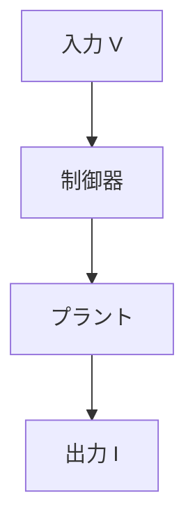

# 44. 【GitHub Page】🧩 GitHub Pagesで数式とMermaidを同時に表示する最小テンプレ
topics: ["GitHubPages", "Jekyll", "MathJax", "Mermaid", "Qiita"]

---

Qiita が求めるのは、  
**「そのまま書けて、実際に動く構成」**です。

- 数式は `$...$` / `$$...$$` のまま  
- 図は ` ```mermaid ` のまま  

それでいて、  
**GitHub Pages 上でも崩れずに表示されること**が重要です。

本記事では、  
MathJax（数式）と Mermaid（図）を  
**同時に安定表示するための最小テンプレ構成**をまとめます。

---

## 🎯 目的

以下を満たす構成を作ります。

- ✍️ Qiita と同じ Markdown 記法を維持する  
- 🧮 数式（MathJax）と図（Mermaid）を同時に表示する  
- 🔁 1つの原稿を Qiita / GitHub Pages 両方で使い回す  

---

## 🗂 構成（最小）

必要なファイルは、以下の 4 つだけです。

```
_config.yml
_layouts/default.html
_includes/head.html
articles/*.md
```

📌  
**余計なプラグインやビルド設定は不要**です。

---

## 🧱 default.html

Markdown 本文を表示するための  
最小のレイアウトです。


<!-- NOTE:
  This code block contains Liquid syntax.
  Wrapped with raw/endraw to prevent Jekyll evaluation.
-->
```html
<!DOCTYPE html>
<html lang="ja">
<head>
  
</head>
<body>
  <main class="page-content">
    <article>
      {{ content }}
    </article>
  </main>
</body>
</html>
```


📌 ポイント  

- `head.html` を必ず読み込む  
- 数式・図の描画は **すべて head 側に集約**します  

---

## 🧠 head.html（MathJax + Mermaid）

数式と図を同時に動かす **中核部分**です。

```html
<script>
  window.MathJax = {
    tex: {
      inlineMath: [['$', '$']],
      displayMath: [['$$', '$$']]
    }
  };
</script>
<script defer src="https://cdn.jsdelivr.net/npm/mathjax@3/es5/tex-chtml.js"></script>

<script defer src="https://cdn.jsdelivr.net/npm/mermaid@10/dist/mermaid.min.js"></script>
<script>
  document.addEventListener("DOMContentLoaded", () => {
    document.querySelectorAll("code.language-mermaid").forEach(code => {
      const div = document.createElement("div");
      div.className = "mermaid";
      div.textContent = code.textContent;
      code.parentElement.replaceWith(div);
    });
    mermaid.initialize({ startOnLoad: false });
    mermaid.run();
  });
</script>
```

📌 ポイント  

- MathJax：**数式はブラウザ側で描画**  
- Mermaid：**DOM 変換 → JavaScript 描画**  
- 両者は干渉せず、同一ページで共存できます  

---

## ✏️ Markdown 記述例（そのまま使える）

以下は、Qiita と **完全に同じ書き方**です。

インライン数式：$V = IR$

$$
\mathbf{A}=
\begin{bmatrix}
0 & 1 \\
- \omega_n^2 & -2 \zeta \omega_n
\end{bmatrix}
$$



👉 数式・行列・Mermaid 図が  
**すべて同一ページで問題なく描画**されます。

---

## 🔍 動作確認デモ

このテンプレ構成で  
**実際に表示されているページ**はこちらです。

- [907 デモページ（数式＋Mermaid 実表示）](https://samizo-aitl.github.io/qiita-articles/articles/907_demo_math_mermaid.html)

📌  
「本当に動いているか」を  
**実ページで確認できるリンク**を置くのが重要です。

---

## ⚠️ 注意点（安定運用のために）

- MathJax / Mermaid ともに  
  **Jekyll が描画するわけではありません**  
- 描画はすべて **ブラウザ側 JavaScript** が担当します  
- `head.html` がレイアウトから読み込まれていないと動作しません  

---

## 📝 まとめ

- ✅ GitHub Pages でも数式と図は同時に表示できる  
- ✅ Qiita と同じ Markdown をそのまま再利用できる  
- ✅ **「Qiitaで書いて、GitHubで育てる」構成が成立する**  

このテンプレを入れておけば、  
数式・図を含む技術記事を  
**Qiita と GitHub Pages の両輪で運用**できます。

907 番は  
**表示確認専用のデモページ**として位置付けるのが最適です。
