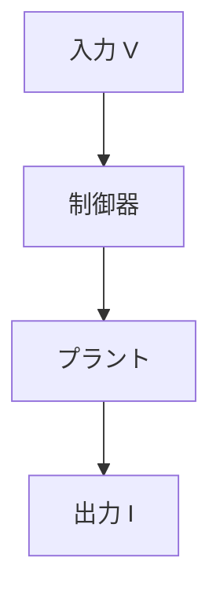

# 44. 【GitHub Page】🧩 GitHub Pages（Jekyll）で Mermaid 図を表示する方法
topics: ["GitHubPages", "Jekyll", "Mermaid", "JavaScript", "Qiita"]

---

Qiita では、Markdown に  
```
 ```mermaid
```
と書くだけで、フローチャートや状態遷移図がそのまま描画されます。

しかし GitHub Pages（Jekyll）では、  
**同じ記法を書いても、そのままではコードブロック表示**になります。

この記事では、

> **Qiita と同じ ` ```mermaid ` 記法を維持したまま**  
> GitHub Pages 上で Mermaid 図を表示する方法

を、**実運用前提・最小構成**で整理します。

---

## 🎯 目的

以下を満たす構成を作ります。

- ✍️ Markdown に ` ```mermaid ` をそのまま書く  
- 🌐 GitHub Pages 上で Mermaid 図として描画する  
- 🔁 Qiita と GitHub Pages で **同一原稿を再利用**する  

---

## 🧠 仕組みの考え方（重要）

GitHub Pages では、

- Jekyll：Markdown → HTML に変換するだけ  
- Mermaid：**ブラウザ側 JavaScript が図を描画する**

という役割分担になります。

そのため、

1. `code.language-mermaid` を検出  
2. Mermaid 用の DOM に変換  
3. Mermaid.js に描画させる  

という処理が必要になります。

---

## 📦 Mermaid を読み込む

まず、`_includes/head.html` に Mermaid.js を読み込みます。

```html
<script defer src="https://cdn.jsdelivr.net/npm/mermaid@10/dist/mermaid.min.js"></script>
```

📌 ポイント  

- `defer` を付けて DOM 構築後に読み込む  
- CDN 利用で追加設定は不要  

---

## 🛠 code ブロックを Mermaid 用に変換

次に、Markdown が生成した HTML を **描画用 DOM に差し替え**ます。

```html
<script>
  document.addEventListener("DOMContentLoaded", () => {
    if (!window.mermaid) return;

    // code.language-mermaid → div.mermaid に変換
    document.querySelectorAll("code.language-mermaid").forEach(code => {
      const pre = code.parentElement;
      const div = document.createElement("div");
      div.className = "mermaid";
      div.textContent = code.textContent;
      pre.replaceWith(div);
    });

    mermaid.initialize({ startOnLoad: false });
    mermaid.run();
  });
</script>
```

📌 ポイント  

- `code.language-mermaid` は kramdown + Rouge の出力結果  
- Jekyll ではなく **ブラウザ側で変換・描画**している点が重要です  

---

## ✏️ Markdown 記述例

以下は、Qiita と **まったく同じ書き方**です。



👉 V–I（電圧–電流）の流れを例にした  
シンプルな制御ブロック図です。

---

## 🔍 実際の表示デモ

この構成を使って **実際に Mermaid 図が描画されているページ**はこちらです。

- [デモページ（Mermaid 表示例）](https://samizo-aitl.github.io/qiita-articles/articles/demo_math_mermaid.html)

📌  
**「コードではなく図として見えているか」**を  
必ず実ページで確認してください。

---

## ⚠️ 注意点（よくあるハマりどころ）

- Jekyll が Mermaid を描画するわけではありません  
  → **JavaScript が描画**します
- `code.language-mermaid` の class 名は  
  Markdown エンジン（kramdown / Rouge）依存です  
- `mermaid.run()` を呼ばないと描画されません  

---

## 📝 まとめ

- ✅ GitHub Pages でも Mermaid 図は表示できる  
- ✅ Qiita と同じ ` ```mermaid ` 記法をそのまま使える  
- ✅ **DOM 変換 → Mermaid.js 描画**が基本構造  
