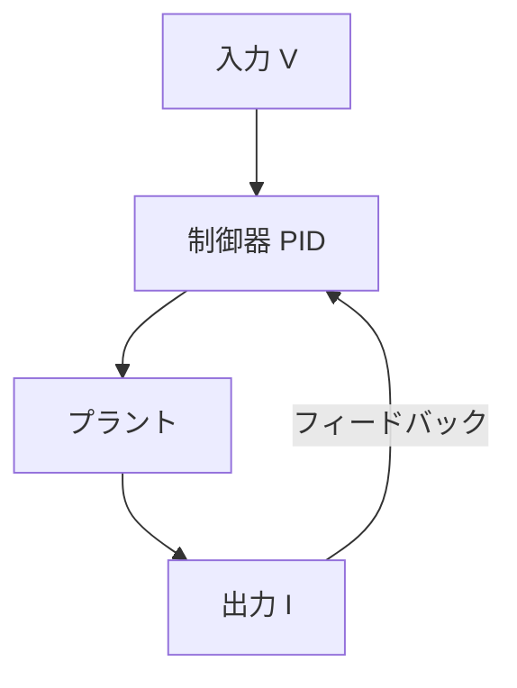
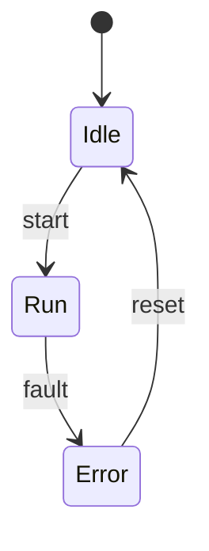

# 数式とMermaidの表示デモ

本記事は、GitHub Pages（Jekyll + MathJax + Mermaid）環境において、  
**Qiita互換 Markdown が正しく描画されるか**を確認するためのデモ記事です。

[GitHub Page](https://samizo-aitl.github.io/qiita-articles/articles/907_demo_math_mermaid.html)

---

## インライン数式

オームの法則は $V = I R$ で表されます。  
ここで、電圧は **V–I 特性**として評価されます。

---

## ブロック数式

以下は、2次系システムの伝達関数です。

$$
G(s) = \frac{\omega_n^2}{s^2 + 2 \zeta \omega_n s + \omega_n^2}
$$

ここで、

| 記号 | 意味 |
|---|---|
| $\omega_n$ | 固有角周波数 |
| $\zeta$ | 減衰係数 |

---

## Mermaid（フローチャート）



---

## Mermaid（状態遷移図）



---

## コードブロック（比較用）

```python
def ohms_law(v, r):
    i = v / r
    return i
```

---

## まとめ

- 数式（MathJax）：正常にレンダリングされます  
- Mermaid：コードブロックから図へ変換されます  
- 表・コード・文章：Qiita記事と同等の可読性です  

本リポジトリは **Qiita記事の一次保管・再編集・可視化基盤として有効**です。
