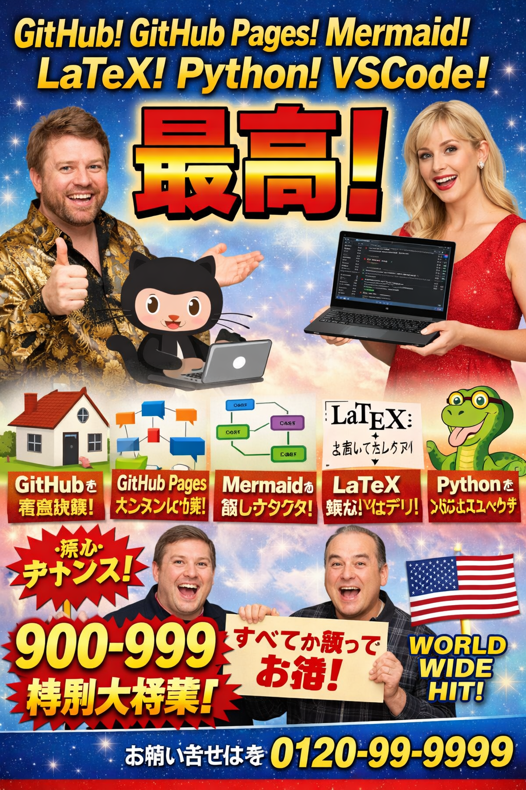

# 907. 【生成AI活用】「技術スタック宣伝画像」を作る  
**GitHub × Pages × Mermaid × LaTeX × Python × VSCode（プロンプト公開）**

topics: ["生成AI", "PromptEngineering", "GitHub", "GitHubPages", "Mermaid", "LaTeX", "Python", "VSCode"]

---



## 📌 この記事のねらい

この画像は、**技術スタックの紹介**を  
あえて 📺 **強いテレビ広告トーン** に寄せて生成しています。

本記事では、同系統の  
👉 **「おもしろい・目に残る宣伝画像」** を  
生成AIで作るための **実用プロンプト** を公開します。

- コピペでそのまま使えます  
- **英語プロンプト中心**です  
- 海外アクティブユーザー向けにも有効です 🌍

---

## ⚡ 使い方（最短手順）

1. text-to-image 型の画像生成AIを開きます  
2. 下記プロンプトをそのまま貼り付けます  
3. 出力結果を見て  
   - 文字量  
   - 要素数  
   - 誤字  
   を確認します  
4. 2〜5回ほど生成して、出来の良いものを選びます  

※ 1回目で完璧になることは稀です。

---

## 🎯 ベースプロンプト（英語）

> 目的：**技術スタックを「盛った宣伝ビジュアル」として出力する**

```text
A humorous, high-impact promo poster for developers, styled like a retro Japanese TV infomercial.
Main headline: “GitHub! GitHub Pages! Mermaid! LaTeX! Python! VSCode!”
Big central punch text in Japanese: “最高!” (meaning “the best!”)
Vibrant gradients, bold outlines, sparkly background, dramatic lighting, exaggerated excitement.
Include playful icon-like visuals representing: GitHub (octocat), a website/page for GitHub Pages, a flowchart for Mermaid, a math formula card for LaTeX, a python mascot, and a code editor laptop for VSCode.
Composition: large headline on top, huge punch word in the center, small feature panels at the bottom.
Make it look like an energetic advertisement poster, comedic but readable.
Avoid real brand logos that are too exact; use generic look-alike icons.
High resolution, sharp text, poster layout, no watermark.
```

---

## 🧩 改造用プロンプト（差分パーツ集）

### 🌍 1) 海外向けを強めたい場合

```text
Add a bold English badge: “WORLDWIDE HIT!”
Add a tagline: “All-in-One Docs + Diagrams + Math + Code”
Make typography mostly English, with one big Japanese punch word “最高!”
```

---

### ✂ 2) 文字を減らして安定させたい場合

```text
Reduce all small texts.
Keep only the main headline, the big “最高!”, and one short English tagline.
Remove tiny captions and phone-number-like elements.
```

---

### 💻 3) ツール感を強めたい場合

```text
Add more developer gear: laptop, terminal window, code snippets, diagram cards.
Use fewer characters and larger icons.
Keep spacing wide and clean.
```

---

### 🎨 4) 背景を変えて量産する場合

```text
Change background to: neon cyberpunk / minimal white studio / comic halftone / space nebula.
Keep the same headline and layout style.
```

---

## ⚠ よくある失敗と回避方法

| 失敗例 | 回避ポイント |
|------|-------------|
| 誤字が多い | 小さい文字を減らします |
| 画面がうるさい | 要素数を減らします |
| ロゴが崩れる | 公式ロゴを避けます |
| 情報過多 | 文字は3か所までにします |

---

### 🔤 誤字対策の要点

- **小さい文字を増やすほど壊れます**  
- 最初は  
  - Headline  
  - Punch word  
  - Tagline  
  の **3点のみ** が安定します

---

## 🧪 最小構成プロンプト（短縮版）

```text
Retro Japanese TV infomercial style developer promo poster.
Headline: “GitHub! GitHub Pages! Mermaid! LaTeX! Python! VSCode!”
Huge Japanese punch word: “最高!”
Sparkly background, bold gradient typography, comedic ad layout.
Include generic icons for website, flowchart, math, python, code editor.
High resolution, poster composition, no watermark.
```

---

## ✅ まとめ

- 🎯 **宣伝画像は記憶に残りやすいです**
- ✂ 文字を減らすほど成功率が上がります
- 🔁 差分プロンプトで量産できます
- 📈 反応が出たら 908 / 909 で派生展開できます

生成AIは  
**技術そのものだけでなく、見せ方にも使えます。**

以上です。
