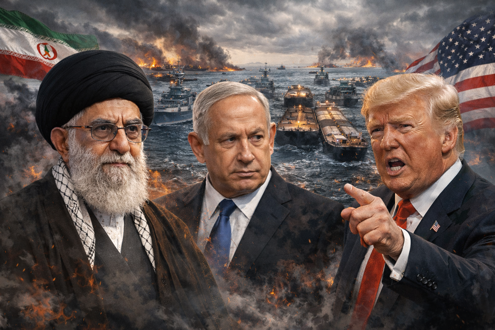

# Z03. 【生成AI活用】ホルムズ海峡での緊迫した対立 AI画像生成プロンプトログ

topics: ["生成AI"]

---



## 概要

本記事では、生成AIによって作成された「ホルムズ海峡での緊迫した対立」を題材とした画像について、  
画像生成プロンプトの記述内容と、実際の描写結果を対応づけて整理します。

対象画像は、ホルムズ海峡を巡る国際的緊張を象徴的に表現した一枚絵であり、  
国家・軍事・政治人物を同時に含む点が特徴です。

---

## 画像に含まれる主な描写要素

本画像には、以下の要素が同時に描かれています。


これらは、すべてプロンプト内で個別に指定された内容です。

---

## 使用した画像生成プロンプト例

以下は、本画像を生成するために使用したプロンプト例です。

```text

```

※ 固有名詞は使用せず、外見・配置・状況のみを記述しています。

---

## プロンプト記述と描写内容


