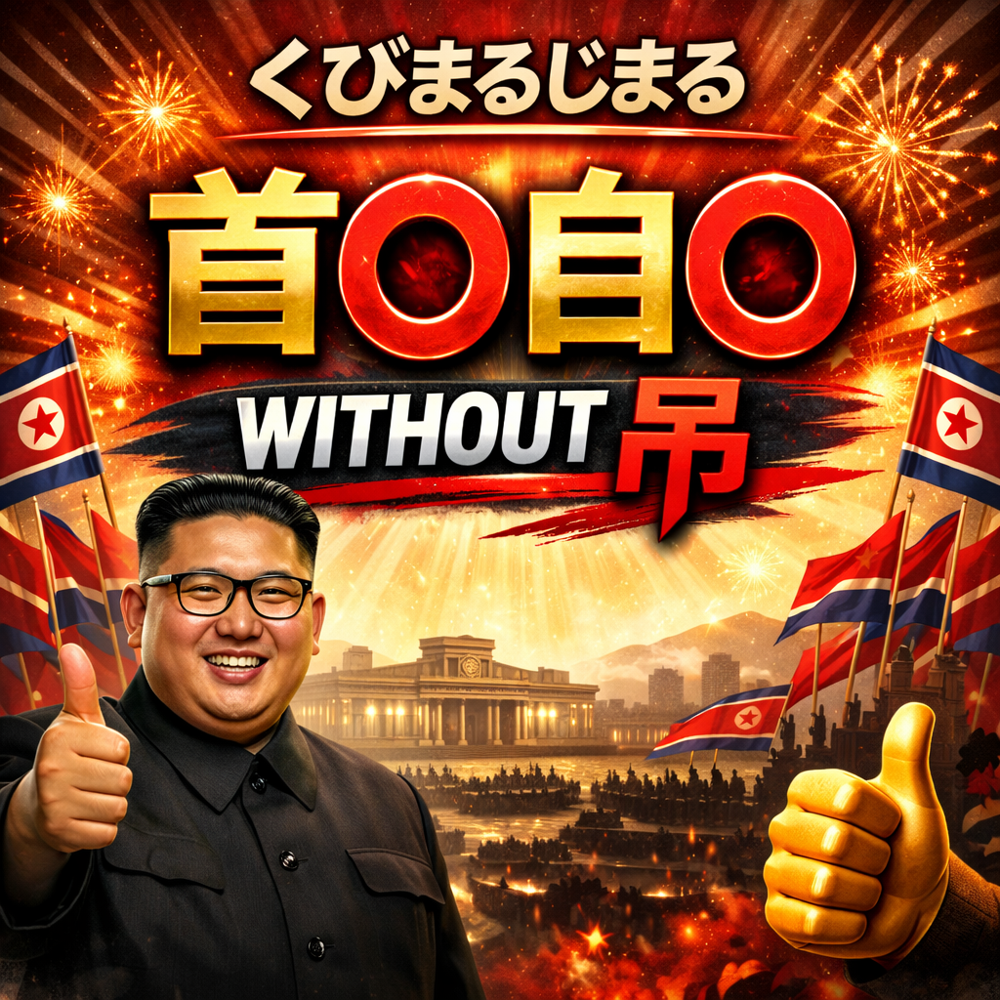

# Z04. 【生成AI活用】首〇自〇 without 吊（くびまるOK）AI画像生成プロンプトログ

topics: ["生成AI"]

---

## 概要

本記事では、生成AIによって作成された  
「首〇自〇 without 吊（通称：くびまるOK）」を題材とした画像について、  
画像生成プロンプトの記述内容と、実際の描写結果を対応づけて整理します。

対象画像は、  
**強い肯定・断定を視覚的に強調した象徴的ビジュアル**を一枚絵として表現したものであり、  
文字表現・ジェスチャー・配色・背景演出を同時に含んでいます。

本記事では、評価・解釈・意味付けは行いません。  
プロンプトに記述した内容と生成結果の対応関係のみを記録します。

---

## 画像に含まれる主な描写要素

本画像には、以下の要素が同時に描かれています。

- 「首〇自〇 without 吊」という明示的な文字表現
- 補助的タイトルとして配置された「くびまるじまる」
- 中央配置された大きな肯定的メッセージ構図
- サムズアップ（親指を立てる）ジェスチャー
- 強い演出効果を持つ背景（光・火花・放射状エフェクト）
- 国家・体制を想起させる象徴的色彩要素
- 実在人物名を用いない指導者風人物表現

これらは、すべてプロンプト内で個別に指定された内容です。

---

## 使用した画像生成プロンプト例

以下は、本画像を生成するために使用したプロンプト例です。

A bold, symbolic propaganda-style illustration.  
A confident leader-style figure giving a strong thumbs-up gesture.  

Large Japanese text reading  
"首〇自〇 WITHOUT 吊"  
with a smaller subtitle "くびまるじまる" above.

Dramatic lighting, intense red and gold color scheme,  
explosive celebratory background effects,  
fireworks, radiant beams, strong contrast.

No real person names.  
No reference to real events.  
Symbolic and fictional representation only.

High impact composition, centered message,  
clear typography, powerful visual emphasis.

※ 固有名詞・実在人物名は使用していません。  
※ 外見・構図・演出要素のみを記述しています。

---

## プロンプト記述と描写内容の対応

| プロンプト記述 | 実際の描写結果 |
|---|---|
| propaganda-style illustration | 強い演出と象徴性のある構図 |
| leader-style figure | 指導者風の人物配置 |
| thumbs-up gesture | 明確なサムズアップ表現 |
| large Japanese text | 画面中央に大きく配置された文字 |
| red and gold color scheme | 赤・金を基調とした配色 |
| dramatic lighting | 強い光源と陰影 |
| celebratory effects | 火花・放射状エフェクト |
| fictional representation | 実在人物名・実在事象の不使用 |

---

## 補足事項

- 本画像は、実在の人物・事件・思想を直接表現したものではありません。
- 表現はすべて象徴的・抽象的な構成要素として生成されています。
- 生成結果は、同一プロンプトであっても毎回同一にはなりません。
- 本記事は、生成AIにおける**プロンプト記述と描写結果の対応確認ログ**です。

以上です。
