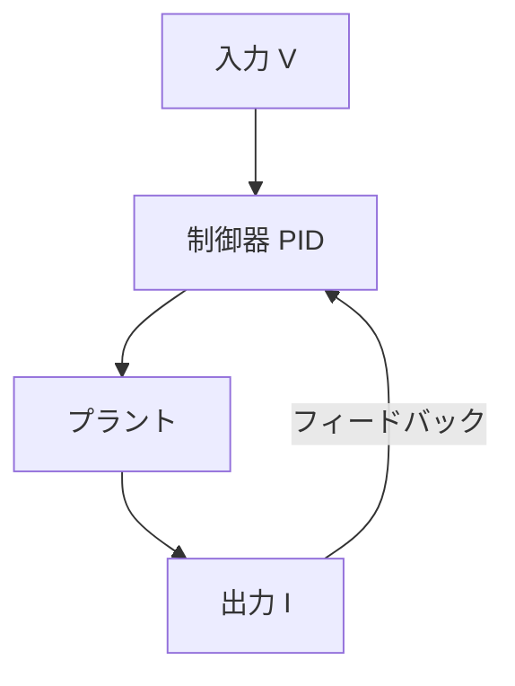
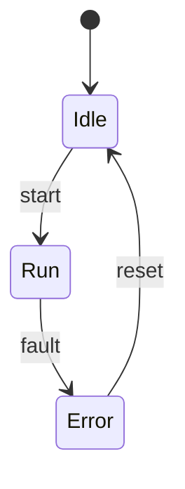

# 🧪 数式・行列・Mermaidの表示デモ

本記事は、GitHub Pages（Jekyll + MathJax + Mermaid）環境において、  
**Qiita互換 Markdown がどこまで正しく・美しく表現できるか**を確認するための  
**総合デモ記事**です。

数式、行列（マトリクス）、表、コード、Mermaid 図をすべて含みます。

---

## 🔗 確認用リンク

- 🌐 [GitHub Pages 表示](https://samizo-aitl.github.io/qiita-articles/articles/demo_math_mermaid.html)  
- 📄 [Markdown 原稿（GitHub）](./demo_math_mermaid.md)

---

## ✏️ インライン数式（基本）

オームの法則は次式で表されます。

$$
V = I R
$$

ここで、電圧–電流特性は **V–I 特性**として評価されます。  
インライン数式も自然に埋め込めます（例：$I = \frac{V}{R}$）。

---

## 📐 ブロック数式（制御系）

以下は、2次遅れ系システムの代表的な伝達関数です。

$$
G(s) = \frac{\omega_n^2}{s^2 + 2 \zeta \omega_n s + \omega_n^2}
$$

| 記号 | 意味 |
|---|---|
| $\omega_n$ | 固有角周波数 |
| $\zeta$ | 減衰係数 |

---

## 🧮 行列（マトリクス）数式

### 状態空間表現

連続時間線形システムは、以下のように表されます。

$$
\begin{aligned}
\dot{\mathbf{x}}(t) &= \mathbf{A}\mathbf{x}(t) + \mathbf{B}\mathbf{u}(t) \\\\
\mathbf{y}(t) &= \mathbf{C}\mathbf{x}(t) + \mathbf{D}\mathbf{u}(t)
\end{aligned}
$$

ここで、行列 $\mathbf{A}, \mathbf{B}, \mathbf{C}, \mathbf{D}$ は次元を持つ定数行列です。

$$
\mathbf{A} =
\begin{bmatrix}
0 & 1 \\\\
- \omega_n^2 & -2 \zeta \omega_n
\end{bmatrix},
\quad
\mathbf{B} =
\begin{bmatrix}
0 \\\\
1
\end{bmatrix}
$$

👉 **行列・ベクトル・太字表記も MathJax で問題なく描画されます。**

---

## 🔢 固有値・線形代数っぽい例

状態行列 $\mathbf{A}$ の固有値は次式から求められます。

$$
\det(\lambda \mathbf{I} - \mathbf{A}) = 0
$$

これにより、システムの安定性（$\Re(\lambda) < 0$）を評価できます。

---

## 🧩 Mermaid（フローチャート）



👉 Markdown 上ではコードブロックですが、  
GitHub Pages では **自動的に図へ変換**されます。

---

## 🔁 Mermaid（状態遷移図）



状態遷移図・FSM 記述にも問題なく対応します。

---

## 💻 コードブロック（比較用）

```python
def ohms_law(v, r):
    """
    オームの法則
    V = I * R
    """
    i = v / r
    return i
```

コード・数式・図が混在しても、レイアウトは崩れません。

---

## ✅ まとめ

- ✨ **MathJax 数式（インライン／ブロック／行列）**：正常に表示されます  
- 📊 **Mermaid 図（フロー／状態遷移）**：自動レンダリングされます  
- 📝 **表・コード・文章**：Qiita 記事と同等、またはそれ以上の可読性です  

本リポジトリは、

> **Qiita 記事の一次原稿管理 ＋  
> 数式・図を含む技術ドキュメントの公開基盤**

として、十分に実用レベルに達しています 🚀

---

📌 このデモが正しく表示されていれば、  
**「Qiitaに投稿できる記事は、すべて GitHub Pages でも再現できている」**  
という判断で問題ありません。
