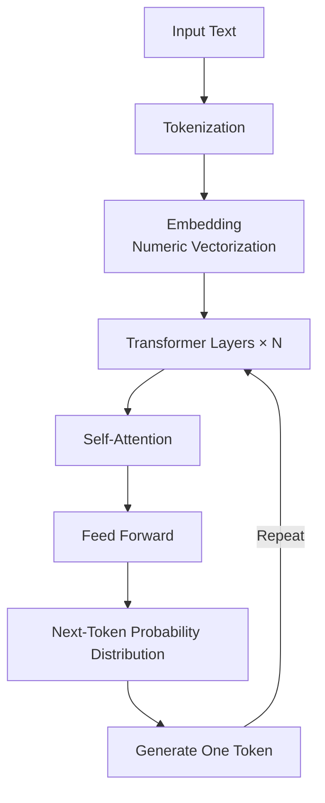
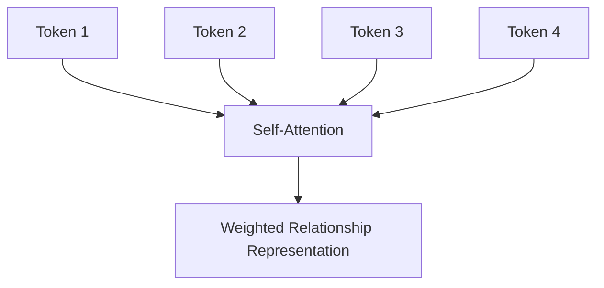
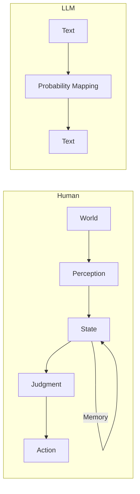

# 24. Understanding LLMs by Structure  
## Why They Make Us Feel Like We “Understand”

tags: [LLM, AI, Design, Mermaid]

---

## 🧭 Introduction

LLMs (Large Language Models) look intelligent.  
They can explain things and appear to reason.

But once you look inside, you realize something important:

**What they are doing is surprisingly simple.**

In this article, we visualize—using **structure (Mermaid diagrams)**—

- 🔍 What an LLM actually is as a system  
- 🧠 Why it *appears* to understand  
- ⚠️ Why it should not be used directly for control or decision-making  

---

## 🎯 What an LLM Actually Does (Conclusion)

An LLM does only one thing, repeatedly:

> **It selects the most likely next token based on probability.**

It does not understand meaning.  
It does not perceive the world.

It is a massive transformer that performs:

**Context → Probability → Generation**

Nothing more.

---

## 🏗 Overall Structure (Inside an LLM)



Only three key points matter:

- 📐 Text is converted into numbers  
- 🎲 Internally, only probability calculations exist  
- 🔁 Tokens are generated one by one  

There is no “thinking” step.

---

## 🔎 What Self-Attention Really Is  
### Why It Looks Like Understanding



Self-Attention:

- 🧩 Computes **relationships between all tokens** in a sentence  
- ⚡ Does so **simultaneously**

This allows the model to capture:

- Subject–predicate relationships  
- Causality  
- Context dependency  

regardless of distance.

The result is text that  
**appears to reflect understanding of context**.

---

## 🧪 Visualizing “Lack of Understanding”

Internally, something like this is happening:

```
Input:
"The mechanism of LLMs is"

Internal probabilities:
--------------------------------
"simple"      : 0.41
"probabilistic": 0.27
"actually"    : 0.12
"complex"     : 0.08
others        : ...
--------------------------------

→ Select the highest probability
```

- ❌ No notion of correctness  
- ❌ No evaluation of truth  
- ⭕ Only probability ranking  

The reason the output feels coherent is that  
the training data encodes **human traces of thought**.

---

## 🧍 The Fundamental Difference Between Humans and LLMs



An LLM has:

- 🧠 State ❌  
- 💾 Memory ❌  
- 🎯 Goals ❌  
- 🌍 World model ❌  

It is simply  
**a function that maps input text to output text**.

---

## 🚫 Why LLMs Should Not Be Used for Control or Judgment

The reason is structural:

- Cannot maintain state  
- Cannot evaluate correctness  
- Cannot preserve temporal continuity  

In short:

> **LLMs lack the components required for control systems**

---

## 🛠 Where LLMs Are Actually Most Effective

- 📝 Converting vague text into structure  
- 📄 Turning logs into candidate causes  
- 🧩 Drafting specifications  
- 🔍 Explaining differences  

They shine in:

**Pre-judgment stages**  
**Human-unfriendly intermediate work**

---

## ✅ Summary

```text
LLM = Intelligence ❌
LLM = Thinking ❌
LLM = Judgment ❌

LLM = Context → Probability → Generation transformer ⭕
```

It may look like a black box,  
but once viewed structurally, its proper placement becomes clear.

> LLMs are useful not when you ask  
> “What can they do?”  
> but when you understand  
> **“Where should they NOT be placed?”**
