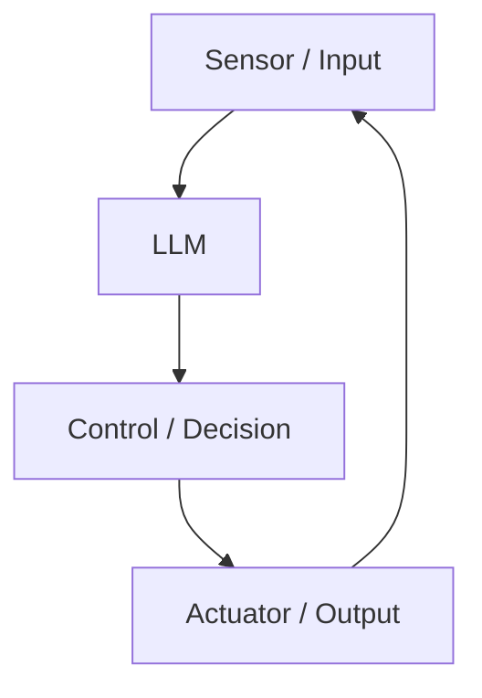
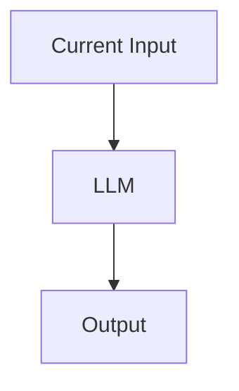
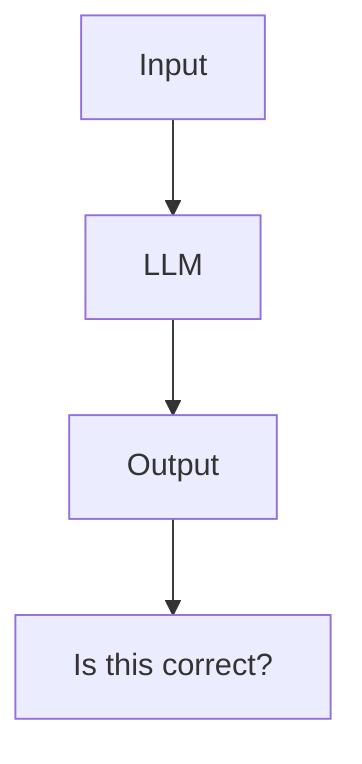
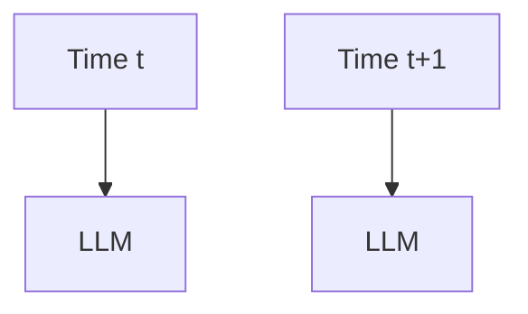
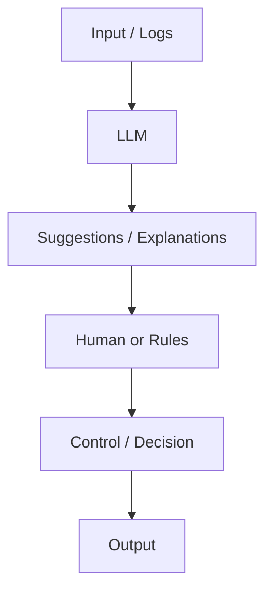

# 25.【LLM Architecture】 What Breaks When You Put an LLM Inside a Control Loop  
## Failure Patterns Explained by Structure

tags: [LLM, AI, Design, Mermaid]

---

## 🧭 Introduction

In the previous article, we clarified that an LLM is essentially  
a **“context → probability → generation” transformer**.

The next natural question is this:

> **What happens if you put that LLM inside a control or decision loop?**

The answer, bluntly stated, is:

**It will break — with high probability.**

In this article, we visualize—using **structure (Mermaid diagrams)**—

- Why it breaks  
- Where it collapses  
- And why it still *appears* to work at first  

---

## 🎯 A Common but Wrong Architecture

Let’s start with a very common setup.



At a glance, it looks like the system:

- Understands input  
- Makes decisions  
- Takes action  

But structurally, this design is **fundamentally broken**.

---

## ❌ Where It Fails (Immediate Fatal Points)

### ① No State Retention



Each time, the LLM:

- Has no internal persistent state  
- Does not remember its previous decisions  

It determines output using **only the current input**.

The essential elements required for control—

**state, history, and continuity**—do not exist.

---

### ② No Ability to Evaluate Correctness



That question mark  
cannot be answered by the LLM itself.

- No success criteria  
- No objective function  
- No failure detection  

In short:

> **Even when it is wrong, it cannot notice that it is wrong.**

---

### ③ No Concept of Time



For an LLM:

- Time t  
- Time t+1  

are simply **independent inputs**.

It cannot internally represent:

- Delay  
- Integration  
- Stability  

or any other **time-dependent control concept**.

---

## 🧨 The “Looks Like It Works” Trap

What makes this dangerous is that  
**it often appears to work at first**.

- Logs read well  
- Explanations sound convincing  
- Demo scenarios succeed  

But once:

- Disturbances occur  
- Unexpected inputs appear  
- The system runs for long periods  

the failure pattern emerges:

```text
• Decisions oscillate
• Outputs become unstable
• Explanations stay confident while results collapse
```

The most dangerous aspect is this:

**It fails confidently.**

---

## 🧱 A Minimal Non-Breaking Placement

So how should an LLM be placed?



Key principles:

- LLM stops at **suggestions**
- Decisions and control live in **another layer**

The LLM:

**does not decide**  
**does not act**

---

## 🛠 Where LLMs Are Actually Safe and Effective

LLMs are strongest at:

- 📝 Generating situation descriptions  
- 📄 Summarizing logs  
- 🔍 Enumerating possible causes  
- 🧩 Drafting rules or designs  

In other words:

> **Only before the decision stage**

Keeping LLMs in this role  
dramatically reduces failure risk.

---

## ✅ Summary

```text
Using an LLM for:
• Control ❌
• Judgment ❌
• Final decisions ❌

Using an LLM for:
• Explanation ⭕
• Organization ⭕
• Drafting ⭕
```

LLMs look intelligent, but  
**they only perform intelligence-like behavior**.

> LLMs are not made dangerous by their capability.  
> **They become dangerous when placed incorrectly.**

---

## 📌 Next Preview

Next, building on this foundation:

- **Why systems become stable when LLMs are placed outside**
- **Why separating layers prevents collapse**

will be explained again  
with **a single Mermaid diagram**.

If continued,  
**26 will be about “structures that do not break.”**
