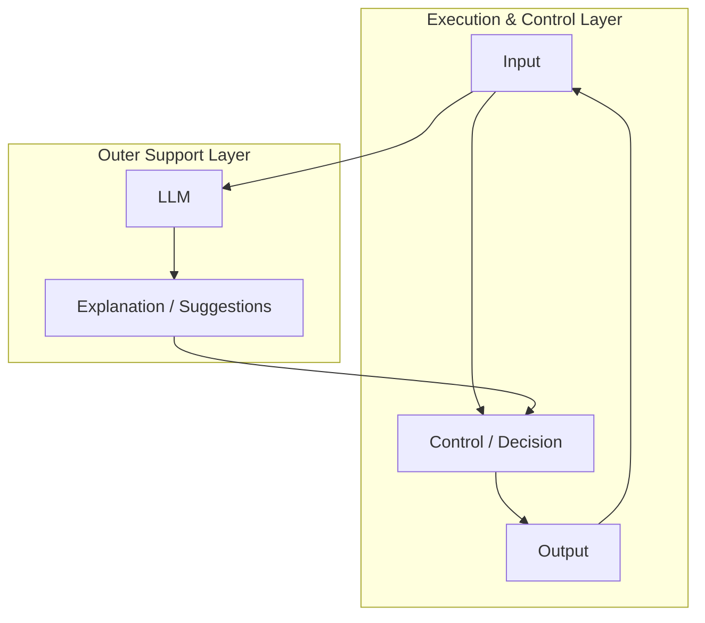
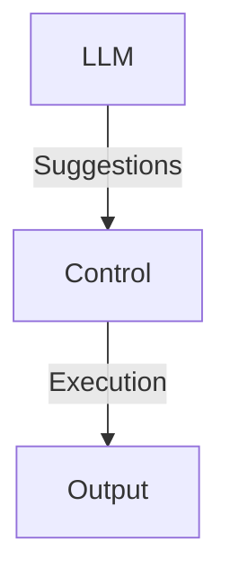
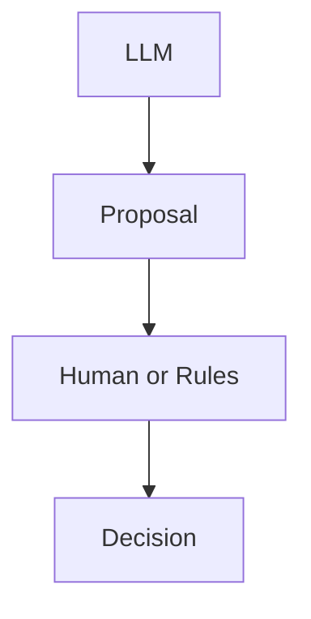
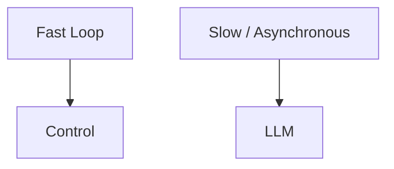
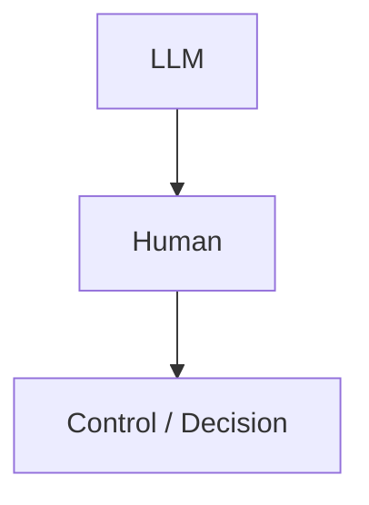

# 26. Why Systems Become Stable When LLMs Are Placed Outside  
## How to Build Structures That Do Not Break

tags: [LLM, AI, Design, Mermaid]

---

## 🧭 Introduction

In the previous article, we clarified  
**why systems break when LLMs are placed inside control or decision loops**.

The next question is this:

> **Why does a system become stable when the LLM is placed “outside”?**

The answer is not philosophical.  
It is a **structural issue**.

In this article, we visualize—using **structure (Mermaid diagrams)**—

- What a non-breaking placement looks like  
- Why separating layers increases stability  
- How far LLMs should be allowed to go  

---

## 🎯 The Fundamental Non-Breaking Structure

First, here is the conclusion in structural form.



The key points of this structure are clear:

- **The control loop is closed**
- The LLM is **outside the loop**
- The LLM does **not change results directly**

---

## 🧱 Why Separating Layers Creates Stability

### ① Roles Do Not Mix



- LLM: language, ambiguity, organization  
- Control: state, judgment, execution  

**Responsibilities do not overlap.**

This alone removes major failure causes.

---

### ② Responsibility for Correctness Is Explicit



- The LLM holds no responsibility  
- Decisions are always made by another layer  

In other words:

> **LLMs are “intelligence without responsibility.”**

By not giving them responsibility, the system becomes safe.

---

### ③ Time Scales Are Separated



- Control: real-time  
- LLM: slow, asynchronous  

Separating time scales prevents:

- Latency  
- Variance  
- Uncertainty  

from contaminating the control loop.

---

## 🛠 Where LLMs Are Most Effective

When placed outside, LLMs can safely handle:

- 📝 Log summarization and explanation  
- 🔍 Enumeration of possible root causes  
- 🧩 Drafting rules and designs  
- 📄 Generating human-readable explanations  

They all share one property:

> **Even if they fail, the system does not immediately break**

---

## 🚫 What LLMs Should Explicitly NOT Do

Once the structure is clear,  
what should *not* be delegated becomes obvious.

```text
• Final decisions
• Execution triggers
• Safety judgments
• Real-time control
```

The moment these are handed over,  
the system becomes fragile again.

---

## 🧠 The Role of Humans



Humans:

- Do not think through everything  
- But make the final decision  

**LLMs outsource thinking**  
**Humans remain the final point of responsibility**

This division of labor is the most realistic.

---

## ✅ Summary

```text
Breaking structure:
LLM → Decision → Execution

Non-breaking structure:
Control → Execution
      ↑
     LLM (suggestions only)
```

LLMs are powerful, but  
**they become toxic when placed incorrectly**.

> Using LLMs wisely does not mean trusting their capability.  
> It means **questioning the structure** in which they are placed.

---

## 📌 Series Recap

- 24: What LLMs really are (transformers)  
- 25: Structures that break (don’t put them in control loops)  
- 26: Structures that don’t break (keep them outside)

With this understanding,  
LLMs stop being “scary” and become  
**tools that can be designed and placed deliberately**.
