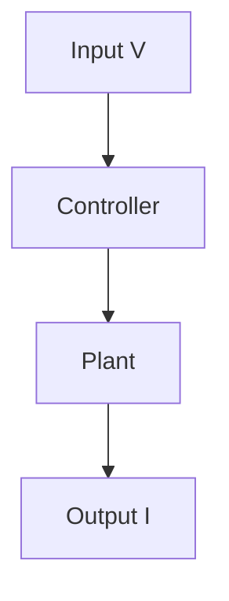

# 43. 【GitHub Pages】🧩 How to Render Mermaid Diagrams on GitHub Pages (Jekyll)
topics: ["GitHubPages", "Jekyll", "Mermaid", "JavaScript", "Qiita"]

---

On Qiita, you can render flowcharts and state diagrams  
simply by writing:
```
```mermaid
```
in Markdown.

However, on GitHub Pages (Jekyll),  
**the same syntax is rendered as a plain code block by default**.

In this article, we explain how to:

> **Keep the same ` ```mermaid ` syntax as Qiita**  
> and render Mermaid diagrams correctly on GitHub Pages

using a **minimal, production-ready configuration**.

---

## 🎯 Goal

We aim to achieve the following:

- ✍️ Write ` ```mermaid ` directly in Markdown  
- 🌐 Render Mermaid diagrams on GitHub Pages  
- 🔁 Reuse the **same Markdown source** for Qiita and GitHub Pages  

---

## 🧠 How It Works (Key Concept)

On GitHub Pages, the responsibilities are split as follows:

- Jekyll: converts Markdown into HTML  
- Mermaid: **renders diagrams via browser-side JavaScript**

Therefore, we need to:

1. Detect `code.language-mermaid` blocks  
2. Convert them into Mermaid-compatible DOM elements  
3. Let Mermaid.js render the diagrams  

---

## 📦 Load Mermaid.js

First, load Mermaid.js in `_includes/head.html`.

```html
<script defer src="https://cdn.jsdelivr.net/npm/mermaid@10/dist/mermaid.min.js"></script>
```

📌 Notes

- Use `defer` to ensure safe loading after DOM construction  
- No additional configuration is required when using the CDN  

---

## 🛠 Convert Code Blocks for Mermaid

Next, replace Markdown-generated HTML  
with Mermaid rendering targets.

```html
<script>
  document.addEventListener("DOMContentLoaded", () => {
    if (!window.mermaid) return;

    // Convert code.language-mermaid → div.mermaid
    document.querySelectorAll("code.language-mermaid").forEach(code => {
      const pre = code.parentElement;
      const div = document.createElement("div");
      div.className = "mermaid";
      div.textContent = code.textContent;
      pre.replaceWith(div);
    });

    mermaid.initialize({ startOnLoad: false });
    mermaid.run();
  });
</script>
```

📌 Notes

- `code.language-mermaid` is generated by kramdown + Rouge  
- Rendering is handled **entirely by the browser**, not by Jekyll  

---

## ✏️ Writing Mermaid in Markdown

This is **exactly the same syntax as on Qiita**.



👉 This example represents a simple control block diagram  
based on a V–I (voltage–current) flow.

---

## 🔍 Live Demo (Rendered Output)

You can confirm that Mermaid diagrams  
are rendered correctly on this live page:

- [907 Demo Page (Mermaid Rendering)](https://samizo-aitl.github.io/qiita-articles/articles/en/907_demo_math_mermaid.html)

📌  
Always verify that the diagram is rendered  
**as a diagram, not as a code block**.

---

## ⚠️ Common Pitfalls

- Mermaid is **not rendered by Jekyll itself**  
  → Rendering is done by **JavaScript in the browser**
- The class name `language-mermaid` depends on  
  the Markdown engine (kramdown / Rouge)
- Forgetting to call `mermaid.run()` prevents rendering  

---

## 📝 Summary

- ✅ GitHub Pages can render Mermaid diagrams  
- ✅ The same ` ```mermaid ` syntax as Qiita can be reused  
- ✅ **DOM conversion → Mermaid.js rendering** is the core mechanism  

Just like MathJax,  
Mermaid is **not unsupported on GitHub Pages**—  
it simply requires a different rendering approach.

With this setup,  
diagram-rich Qiita articles can be  
**grown and maintained directly on GitHub Pages**.
