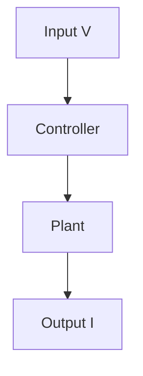

# 44. 【GitHub Pages】🧩 Minimal Template to Render Math and Mermaid Together on GitHub Pages (Jekyll)

What Qiita really expects is a setup that is:

> **“Written as-is, and actually works.”**

- Math stays as `$...$` / `$$...$$`  
- Diagrams stay as ` ```mermaid `  

And yet,  
everything must render correctly on **GitHub Pages** as well.

In this article, we summarize a **minimal and stable template**  
to render **MathJax (math)** and **Mermaid (diagrams)**  
**together on the same page**.

---

## 🎯 Goal

We aim to achieve the following:

- ✍️ Keep the same Markdown syntax as Qiita  
- 🧮 Render math (MathJax) and diagrams (Mermaid) simultaneously  
- 🔁 Reuse a **single Markdown source** for Qiita and GitHub Pages  

---

## 🗂 Minimal Structure

Only the following four files are required.

```
_config.yml
_layouts/default.html
_includes/head.html
articles/*.md
```

📌  
**No extra plugins or build settings are required.**

---

## 🧱 `default.html`

This is the minimal layout for rendering Markdown content.


```html
<!DOCTYPE html>
<html lang="ja">
<head>
  
</head>
<body>
  <main class="page-content">
    <article>
      {{ content }}
    </article>
  </main>
</body>
</html>
```


📌 Notes

- Always include `head.html`  
- All rendering logic (math + diagrams) is centralized there  

---

## 🧠 `head.html` (MathJax + Mermaid)

This is the **core of the entire setup**.

```
<script>
  window.MathJax = {
    tex: {
      inlineMath: [['$', '$']],
      displayMath: [['$$', '$$']]
    }
  };
</script>
<script defer src="https://cdn.jsdelivr.net/npm/mathjax@3/es5/tex-chtml.js"></script>

<script defer src="https://cdn.jsdelivr.net/npm/mermaid@10/dist/mermaid.min.js"></script>
<script>
  document.addEventListener("DOMContentLoaded", () => {
    document.querySelectorAll("code.language-mermaid").forEach(code => {
      const div = document.createElement("div");
      div.className = "mermaid";
      div.textContent = code.textContent;
      code.parentElement.replaceWith(div);
    });
    mermaid.initialize({ startOnLoad: false });
    mermaid.run();
  });
</script>
```

📌 Notes

- MathJax: math is rendered **in the browser**  
- Mermaid: **DOM conversion → JavaScript rendering**  
- Both coexist safely on the same page  

---

## ✏️ Markdown Writing Example (As-Is)

The following works **exactly the same as on Qiita**.

Inline math: $V = IR$

$$
\mathbf{A}=
\begin{bmatrix}
0 & 1 \\
- \omega_n^2 & -2 \zeta \omega_n
\end{bmatrix}
$$



👉 Math, matrices, and Mermaid diagrams  
are **all rendered correctly on a single page**.

---

## 🔍 Live Demo (Rendered Output)

You can see the actual rendered result here:

- [907 Demo Page (Math + Mermaid Rendering)](https://samizo-aitl.github.io/qiita-articles/articles/en/907_demo_math_mermaid.html)

📌  
Always include a **real, working demo link**  
to prove that the setup actually works.

---

## ⚠️ Notes for Stable Operation

- Neither MathJax nor Mermaid is rendered by Jekyll itself  
- All rendering is done by **browser-side JavaScript**
- If `head.html` is not included from the layout, nothing will render  

---

## 📝 Summary

- ✅ GitHub Pages can render math and diagrams together  
- ✅ The same Markdown source can be reused for Qiita  
- ✅ **“Write on Qiita, grow on GitHub Pages” becomes practical**

With this template in place,  
technical articles containing math and diagrams can be  
**maintained seamlessly across Qiita and GitHub Pages**.

The `907` article should be treated as  
a **dedicated demo page for rendering verification**.
