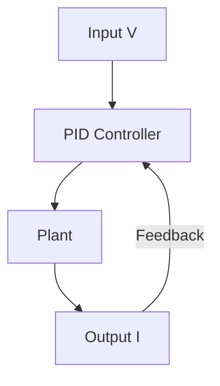
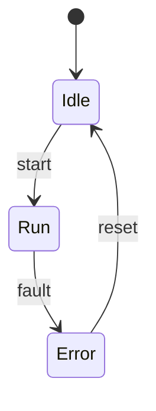

# 🧪 Math, Matrix, and Mermaid Rendering Demo

This article is a **comprehensive demo** to verify how far  
**Qiita-compatible Markdown** can be rendered **accurately and beautifully**  
on **GitHub Pages (Jekyll + MathJax + Mermaid)**.

It includes mathematical formulas, matrix expressions, tables, code blocks,  
and Mermaid diagrams — all in a single page.

---

## 🔗 Demo Links

- 🌐 [GitHub Pages View](https://samizo-aitl.github.io/qiita-articles/articles/907_demo_math_mermaid.html)  
- 📄 [Markdown Source (GitHub)](./907_demo_math_mermaid.md)

---

## ✏️ Inline Math (Basics)

Ohm’s law is expressed as follows:

$$
V = I R
$$

Here, the voltage–current relationship is evaluated as the **V–I characteristic**.  
Inline math can also be embedded naturally (example: $I = \frac{V}{R}$).

---

## 📐 Block Math (Control Systems)

The following is a representative transfer function of a second-order system:

$$
G(s) = \frac{\omega_n^2}{s^2 + 2 \zeta \omega_n s + \omega_n^2}
$$

| Symbol | Meaning |
|---|---|
| $\omega_n$ | Natural angular frequency |
| $\zeta$ | Damping ratio |

---

## 🧮 Matrix (Linear Algebra) Expressions

### State-Space Representation

A continuous-time linear system can be expressed as:

$$
\begin{aligned}
\dot{\mathbf{x}}(t) &= \mathbf{A}\mathbf{x}(t) + \mathbf{B}\mathbf{u}(t) \\\\
\mathbf{y}(t) &= \mathbf{C}\mathbf{x}(t) + \mathbf{D}\mathbf{u}(t)
\end{aligned}
$$

Here, the matrices $\mathbf{A}, \mathbf{B}, \mathbf{C}, \mathbf{D}$  
are constant matrices with appropriate dimensions.

$$
\mathbf{A} =
\begin{bmatrix}
0 & 1 \\\\
- \omega_n^2 & -2 \zeta \omega_n
\end{bmatrix},
\quad
\mathbf{B} =
\begin{bmatrix}
0 \\\\
1
\end{bmatrix}
$$

👉 **Matrices, vectors, and bold notation are all rendered correctly by MathJax.**

---

## 🔢 Eigenvalues (Linear Algebra Example)

The eigenvalues of the state matrix $\mathbf{A}$ are obtained from:

$$
\det(\lambda \mathbf{I} - \mathbf{A}) = 0
$$

This allows us to evaluate system stability  
(e.g., $\Re(\lambda) < 0$).

---

## 🧩 Mermaid (Flowchart)



👉 In Markdown this is just a code block,  
but on GitHub Pages it is **automatically rendered as a diagram**.

---

## 🔁 Mermaid (State Diagram)



State diagrams and FSM-style descriptions are fully supported.

---

## 💻 Code Block (for Comparison)

```python
def ohms_law(v, r):
    """
    Ohm's Law
    V = I * R
    """
    i = v / r
    return i
```

Even with math, diagrams, and code mixed together,  
the layout remains stable and readable.

---

## ✅ Summary

- ✨ **MathJax math (inline, block, matrices)** renders correctly  
- 📊 **Mermaid diagrams (flowcharts, state diagrams)** are automatically rendered  
- 📝 **Tables, code, and text** achieve Qiita-level or better readability  

This repository effectively functions as:

> **A single source of truth for Qiita articles**, combined with  
> **a publishing platform for math- and diagram-rich technical documents**.

---

📌 If this demo page renders correctly, you can safely conclude that:

> **Any article that can be posted on Qiita can also be reproduced on GitHub Pages  
> without losing mathematical expressions or diagrams.**

🚀
