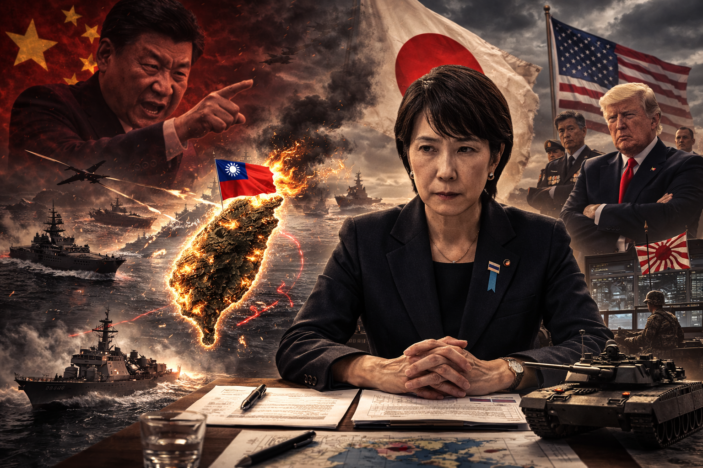

# Z01. 【Generative AI Use】Prompt Record for AI Image Generation Including Flags and Military Elements

topics: ["Generative AI"]

---



## Overview

This article examines an image generated by generative AI titled  
“Taiwan Contingency and Minister Takaichi,” focusing on the relationship between  
the image generation prompt and the resulting visual output.

The image represents geopolitical tension surrounding Taiwan in a symbolic manner  
and simultaneously includes national, military, and political elements.

---

## Major Visual Elements in the Image

The image contains the following elements at the same time:

- A geographical depiction centered on the island of Taiwan  
- Visualization of crisis through fire, explosions, and smoke  
- National flags representing Taiwan, China, Japan, and the United States  
- Political figures evoking real individuals  
- Warships and fighter jets  
- A dark color palette with strong contrast  

All of these elements are explicitly specified within the prompt.

---

## Example of the Image Generation Prompt Used

Below is an example of the prompt used to generate this image.

```text
A dramatic geopolitical illustration depicting a Taiwan contingency.
In the center, the island of Taiwan is shown surrounded by flames and explosions,
with a Taiwanese flag planted on the island.
Warships and fighter jets operate in the surrounding sea and sky.

On the left, a Chinese leader is shown angrily pointing forward,
with a red background and Chinese national symbols.
On the right, a Japanese female politician appears calm but tense,
with the Japanese flag behind her.
Further right, the United States president stands with crossed arms,
with the American flag and military personnel in the background.

Dark, cinematic lighting, high contrast, ultra-detailed, realistic style,
epic atmosphere, 4K resolution, political tension, global crisis.
```

*Proper names are not used; only appearance, placement, and context are described.*

---

## Prompt Descriptions and Visual Results

### Taiwan Island and Crisis Representation

- `the island of Taiwan`  
- `surrounded by flames and explosions`  

Taiwan is placed at the center of the image, visually emphasizing a state of crisis.

---

### Military Elements

- `Warships and fighter jets`  
- `operate in the surrounding sea and sky`  

Military tension is depicted across both maritime and aerial domains.

---

### Representation of Political Figures

- China: an angry facial expression with a red-toned background  
- Japan: a calm but tense expression with the Japanese flag  
- United States: arms crossed, with military personnel in the background  

Emotions and posture are defined directly through descriptive wording in the prompt.

---

### Overall Visual Tone

- `dark, cinematic lighting`  
- `high contrast`  
- `epic atmosphere`  

The image is presented as a symbolic illustration rather than a documentary-style photograph.

---

## Notes

- Even when evoking real individuals, personal names are not directly specified.  
- Flags and military imagery may be subject to restrictions depending on the AI model used.  
- Output results may vary depending on the model version and configuration.

---

## Summary

This image is generated by explicitly specifying the following elements:

- Geography  
- Military presence  
- Political figures  
- Emotional expression  

By listing each component clearly within the prompt,  
similar images can be reproduced with higher consistency.

This concludes the full English version of the image generation prompt analysis.
