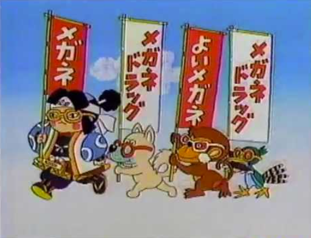
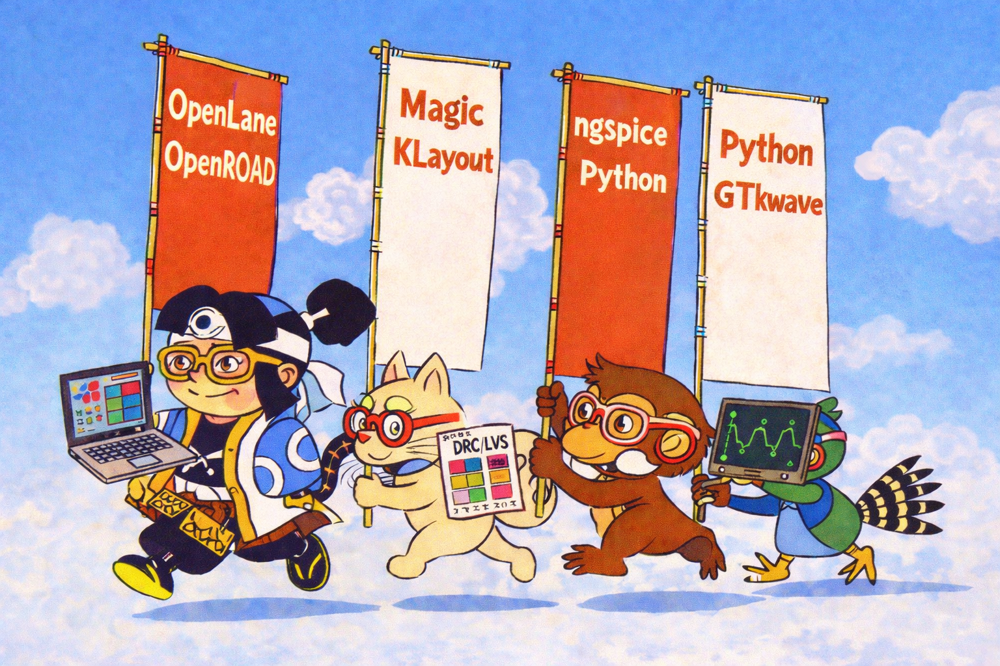

# 914. [Generative AI Usage] OpenLane March — Image Generation Log Based on the Showa-Era CM “Megane Drug”

topics: ["Generative AI"]

---

## Source Image

---

## Generated Image

---

## Overview

This article records only the correspondence between  
the **source image taken from a Japanese Showa-era TV commercial “Megane Drug” (megane_drug.png)**  
and the **generated image derived from it (openlane_megane_drug.png)**.

No evaluation, interpretation, cultural analysis, or justification is provided  
for either the original commercial or the generated result.

The scope of this document is limited to  
**whether specified visual elements appear in the generated image**.

---

## Visual Elements in the Source Image

The source image **megane_drug.png** contains the following elements:

- A group of multiple characters marching horizontally
- Each character holding a tall vertical banner
- Large, highly visible text placed on each banner
- A simple background composed of sky and clouds
- All characters wearing glasses
- Spacing and posture emphasizing forward movement

These elements were used **only as visual references** during image generation.

---

## Visual Elements in the Generated Image

The generated image **openlane_megane_drug.png** includes the following elements:

- A horizontal marching formation similar to the source image
- Characters holding tall vertical banners
- The following text elements displayed on the banners:
  - OpenLane  
  - OpenROAD  
  - Magic  
  - KLayout  
  - ngspice  
  - Python  
  - GTKWave
- A sky-and-cloud background consistent with the reference
- Distinct technical props held by individual characters

Text elements are presented **as labels only**,  
without descriptions, explanations, or functional claims.

---

## Correspondence Between Reference and Result

| Reference / Prompt Element | Observed Result |
|---|---|
| Horizontal marching layout | Similar formation reproduced |
| Vertical banners | Banner shapes present |
| Text-centered banners | Tool names displayed |
| Sky and cloud background | Matching background style |
| Characters wearing glasses | All characters depicted with glasses |

---

## Notes

- **megane_drug.png** was used strictly as a reference image.
- **openlane_megane_drug.png** is a derived generated image.
- Tool names appear **only as textual elements**.
- This article serves as a **generation log documenting reference–result correspondence**.
- Identical prompts may produce different results on each generation.

End of record.
