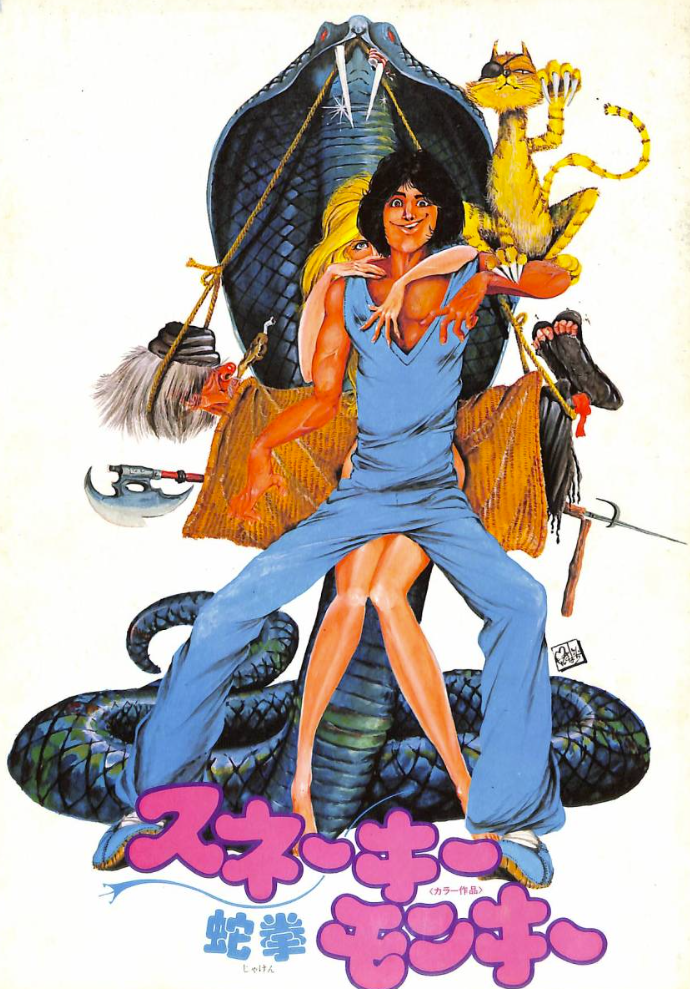
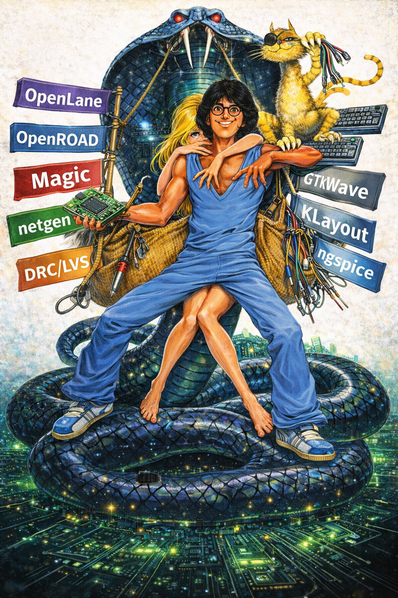

# 915. [Generative AI Usage] OpenLane Procession — Symbolic Visual Generation Log Based on the Film Poster “Snake in the Eagle’s Shadow”

topics: ["Generative AI"]

---

## Source Image

---

## Generated Image

---

## Overview

This article documents  
**the use of a film poster image from “Snake in the Eagle’s Shadow” (jackie_snake.png) as a reference source,  
and the image generated by referencing it (openlane_jackie_snake.png)**,  
focusing **only on the correspondence between the image generation prompt descriptions and the visual elements appearing in the generated result**.

This article  
**does not provide any evaluation, interpretation, or meaning attribution**  
to the original image, the generated image, or the textual elements included.

---

## Primary Visual Elements in the Source Image

The source image **jackie_snake.png** contains the following elements:

- A centrally positioned human character
- A large snake motif placed behind the main character
- Multiple characters overlapping around the central figure
- An animal character (cat)
- Various tools and props arranged around the figures
- A simplified background emphasizing the main subjects

These elements are **used solely as reference inputs during generation**.

---

## Primary Visual Elements in the Generated Image

The generated image **openlane_jackie_snake.png** includes the following observable elements:

- A composition centered around a main human character
- A snake-shaped motif placed in the background
- Multiple characters layered over the central figure
- Placement of an animal character
- Additional props representing technical elements
- Banner-like or label-style text elements displaying tool names:
  - OpenLane  
  - OpenROAD  
  - Magic  
  - netgen  
  - DRC/LVS  
  - GTKWave  
  - KLayout  
  - ngspice  
  - Python

---

## Correspondence Between Prompt Specification and Visual Output

| Source Element / Prompt Specification | Generated Result |
|---|---|
| Central character composition | Centrally placed character |
| Snake motif | Background snake-shaped object |
| Overlapping character layout | Multiple layered characters |
| Animal character | Repositioned animal motif |
| Presence of props | Technical-themed props |
| Text element specification | Display of tool names |

---

## Notes

- **jackie_snake.png** is used **only as a reference image**.
- **openlane_jackie_snake.png** is a **derived generation result**.
- This article serves as a **log documenting correspondence between the source image, prompt specifications, and generated output**.
- No statements are made regarding success, failure, quality, or intent validity.

End of document.
